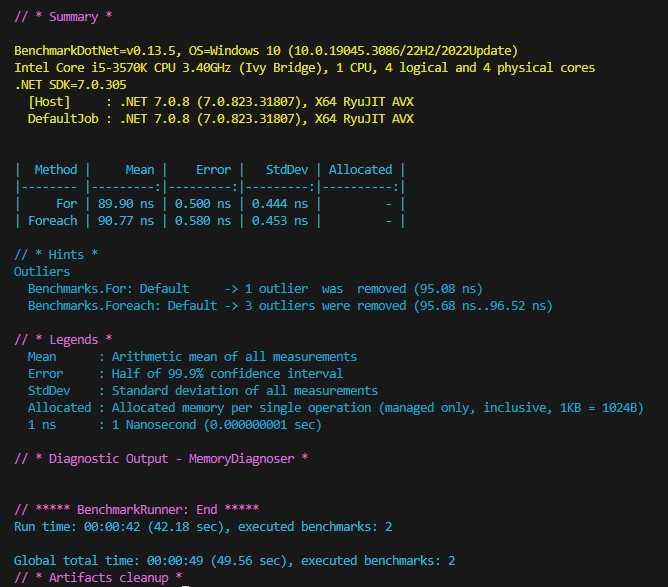
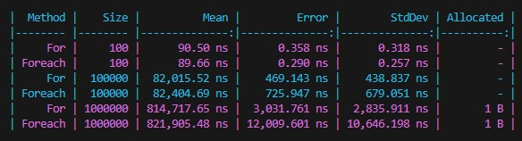
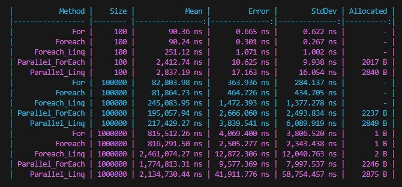

# The fastest way to iterate a List

This project shows the most efficient way to iterate through the list

## Benchmark library

There is an overview of [the Benchmark library](https://benchmarkdotnet.org/articles/overview.html).

There is a nice [article](https://betterprogramming.pub/how-to-benchmark-c-code-using-benchmarkdotnet-6de06165f2cb) about this library.

**Note**: This library is availible only for the console app for now. The build should be run in Release mode. Use script `task.json` to define Release build in VS Code (look at the committed file in `.vscode` folder):
```
    {
        "taskName": "build Release",
        "command": "dotnet",
        "type": "process",
        "args": [
            "build",
            "${workspaceFolder}/Lists.csproj",
            "-c",
            "Release"
        ],
        "problemMatcher": "$msCompile"
    }
```
To run this build use the command:
```
dotnet run --configuration Release
```

## Setting up the list

There are 7 different methods to iterate through the list in the Benchmarks class:
- `For` - standard `for` cycle
- `Foreach` - standard `foreach` cycle
- `Foreach_Linq` - `foreach` using linq
- `Parallel_ForEach` - `foreach` using `Parallel`
- `Parallel_Linq` - `foreach` using `Parallel` and method `ForAll`
- `Foreach_Span` - converting list to a span first and running it throgh `foreach` cycle
- `For_Span` - same as previous but using `for` cycle

## Results

1. The first run was just for 2 methods `For` and `Foreach` with 100 items in the list. Results show that they are approximately the same in performance:



2. The second time it was three separate jobs for both `For` and `Foreach`. The number of items was: 100, 100 000 and 1 000 000. Some difference starts to appear in high numbers when we deal with 1 million items in collections:



3. One more included all methods and we could see that the Span is the most efficient way to iterate through the list but there is a catch here as well. If we look inside the description of the `CollectionsMarshal` and `AsSpan`. it says that:
```
    // Summary:
    //     An unsafe class that provides a set of methods to access the underlying data
    //     representations of collections.
```
That would mean we should choose that one only in situations when there is no need to modify the collection and keep it the way it is.


